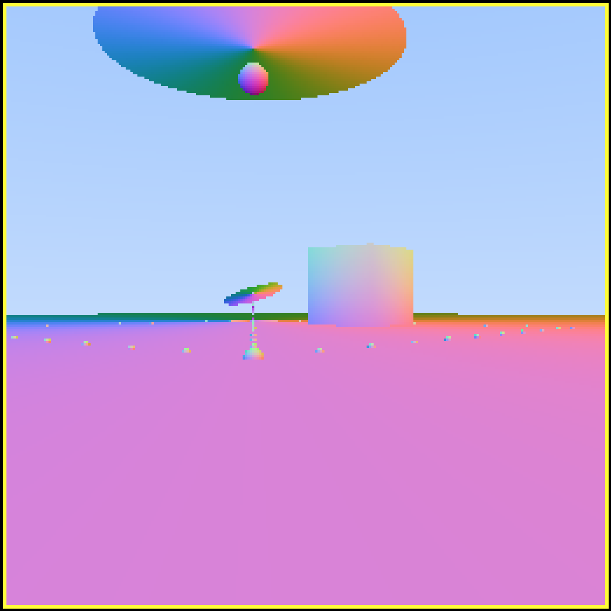

# ray tracing in your browser
Ray tracing a 3d world in the browser using javascript and math calulations are utilizing GPU hardware for fast performance



- try it out! at https://3d.kevindial.com/
- on desktop, use WASD to move player and mouse to move screen
- on mobile, touch bottom left quadrant to move player and touch bottom right quadrant to move screen

# video


https://user-images.githubusercontent.com/2696834/226995908-ad9aac3e-74b8-42f7-8626-bd1c025cabc8.mov


# learning ray tracing (path tracer)

resource: https://raytracing.github.io/books/RayTracingInOneWeekend.html

vector library source: https://github.com/evanw/lightgl.js/blob/master/src/vector.js


```
yarn start
yarn build
```


# benchmarks

```
Should aim for 16ms.

1. simple javascript
249 ms to render 256 x 256

```


# to debug gpu.js

```
window.kernalFn = kernal.toString(cameraOrigin, cameraAngle)
console.log(window.kernalFn);
```

